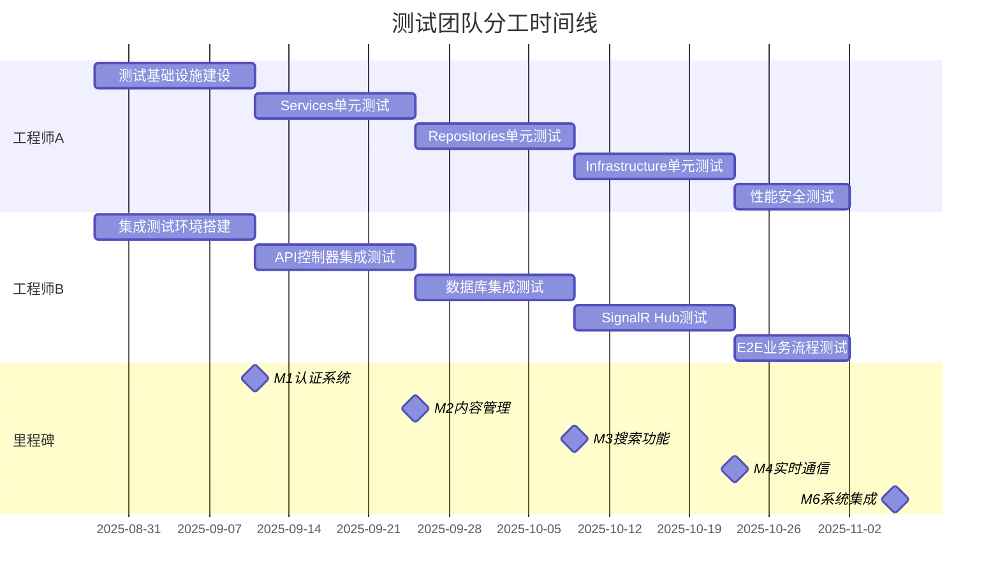

# Forum.Api 测试团队分工策略

> **版本**: 1.0  
> **日期**: 2025-08-28  
> **团队**: 2名测试工程师  
> **目标**: 最大化并行作业，消除阻塞依赖

## 概述

基于 [TESTING_STRATEGY.md](TESTING_STRATEGY.md) 的测试金字塔模型，本文档定义了两名测试工程师的专业分工方案，通过垂直分层和水平解耦实现高效并行协作。

### 分工原则
- **垂直分层**：按测试金字塔层次划分职责边界
- **水平解耦**：通过接口隔离和环境分离消除阻塞
- **专业深化**：每人专精特定领域，提升测试质量和效率
- **并行优化**：最大化独立作业时间，最小化协作等待

## 团队角色定义

### 🔧 工程师A：底层基础测试专家 (Foundation Test Engineer)

**专精领域**：单元测试 + 基础设施 + 性能安全测试

**核心职责**：
- **单元测试层 (70%)**：Services、Repositories、Infrastructure 层测试实现
- **测试基础设施**：TestDataBuilder、测试夹具、Mock 服务配置
- **性能与安全测试**：基准测试、安全防护验证、压力测试

### 🌐 工程师B：应用层集成测试专家 (Integration Test Engineer)

**专精领域**：集成测试 + E2E测试 + 实时通信测试

**核心职责**：
- **集成测试层 (20%)**：API 控制器、数据库集成、SignalR Hub 测试
- **E2E 测试层 (10%)**：端到端业务流程验证
- **实时通信测试**：SignalR 连接、消息广播、房间管理

## 详细任务分配

### 工程师A - 任务清单

#### 阶段1：测试基础设施建设 (Sprint 1)
**目标**：建立稳固的单元测试基础和共享测试工具

**任务列表**：
1. **TestDataBuilder 模式实现**
   - `UserTestDataBuilder`: 用户实体构建器（角色、权限、状态变体）
   - `TopicTestDataBuilder`: 主题实体构建器（分类、标签、状态变体）
   - `PostTestDataBuilder`: 帖子实体构建器（回复关系、@提及变体）
   - `CategoryTestDataBuilder`: 分类层次构建器
   - `TagTestDataBuilder`: 标签关联构建器

2. **Mock 服务配置**
   - `IEmailService` Mock 配置和行为定义
   - 第三方 API Mock Server 搭建
   - 外部依赖模拟器配置

3. **测试夹具 (Fixtures) 设计**
   - `BaseUnitTestFixture`: 单元测试基础类
   - `ServiceTestFixture`: 服务层测试夹具
   - `RepositoryTestFixture`: 仓储层测试夹具
   - `InfrastructureTestFixture`: 基础设施层测试夹具

#### 阶段2：Services 层单元测试 (Sprint 2-4)
**目标**：完成业务逻辑层的全覆盖单元测试

**任务列表**：
1. **认证服务测试** (`AuthService`)
   - 用户注册逻辑：邮箱验证、密码强度、唯一性检查
   - 登录验证逻辑：凭据检查、JWT 生成、RefreshToken 管理
   - 权限验证逻辑：角色检查、资源访问控制
   - 异常场景：无效输入、账户状态异常、外部服务故障

2. **主题服务测试** (`TopicService`)
   - 主题 CRUD 操作：创建、更新、删除、查询逻辑
   - 权限控制：创建权限、编辑权限、删除权限验证
   - 统计更新：帖子数、浏览数、最后回复时间同步
   - 业务规则：锁定状态、置顶逻辑、分类移动验证

3. **帖子服务测试** (`PostService`)
   - 帖子 CRUD 操作：创建、编辑、删除、查询逻辑
   - Markdown 处理：内容渲染、XSS 防护、链接处理
   - @提及解析：用户名解析、通知触发、权限检查
   - 回复关系：回复层级、引用关系、删除级联

4. **分类服务测试** (`CategoryService`)
   - 分类管理：创建、更新、删除、排序逻辑
   - 权限验证：管理权限、访问权限检查
   - 统计维护：主题计数、帖子计数同步

5. **标签服务测试** (`TagService`)
   - 标签管理：创建、关联、使用统计更新
   - Slug 生成：URL 友好字符串生成和唯一性保证
   - 关联管理：主题标签关系维护

6. **用户服务测试** (`UserService`)
   - 用户管理：资料更新、角色分配、状态管理
   - 权限系统：角色继承、权限检查、权限缓存

#### 阶段3：Repositories 层单元测试 (Sprint 2-4)
**目标**：验证数据访问逻辑和 SQL 查询正确性

**任务列表**：
1. **用户仓储测试** (`UserRepository`)
   - CRUD 操作：Insert、Update、Delete、Select 逻辑验证
   - 复杂查询：按角色查询、邮箱验证状态查询、活跃用户统计
   - 参数化查询：SQL 注入防护验证
   - 并发控制：乐观锁、版本冲突检测

2. **主题仓储测试** (`TopicRepository`)
   - 分页查询：Keyset 分页逻辑、游标处理、性能验证
   - 筛选查询：分类筛选、标签筛选、状态筛选组合
   - 关联查询：分类信息、标签信息、作者信息联表查询
   - 统计查询：主题计数、回复计数、浏览计数准确性

3. **帖子仓储测试** (`PostRepository`)
   - 回复关系：父子关系查询、回复层级限制、删除级联
   - @提及查询：被提及用户提取、通知目标用户查询
   - 全文搜索：关键词匹配、相关性排序、搜索性能
   - 分页性能：大数据集分页、索引使用效果

4. **其他仓储测试**
   - `CategoryRepository`: 层次查询、排序逻辑、统计更新
   - `TagRepository`: 标签关联、使用统计、热门标签查询
   - `RefreshTokenRepository`: Token 存储、过期清理、安全验证

#### 阶段4：Infrastructure 层单元测试 (Sprint 3-4)
**目标**：验证基础设施组件功能和安全性

**任务列表**：
1. **JWT Token 服务测试** (`JwtTokenService`)
   - Token 生成：有效载荷、签名算法、过期时间设置
   - Token 验证：签名验证、过期检查、载荷提取
   - Token 刷新：RefreshToken 验证、新 Token 生成
   - 安全测试：伪造 Token 检测、算法攻击防护

2. **密码服务测试** (`PasswordService`)
   - 密码哈希：BCrypt 哈希生成、盐值随机性
   - 密码验证：哈希匹配验证、时序攻击防护
   - 强度检查：复杂度验证、常见密码检测
   - 性能测试：哈希计算时间、并发处理能力

3. **邮件服务测试** (`EmailService`)
   - 邮件发送：SMTP 连接、邮件格式、错误处理
   - 模板渲染：HTML 模板、变量替换、多语言支持
   - 发送队列：异步发送、重试机制、失败处理
   - 安全验证：防垃圾邮件、发送频率限制

4. **数据库迁移器测试** (`DatabaseMigrator`)
   - 迁移执行：SQL 脚本执行、事务管理、错误回滚
   - 版本管理：迁移版本跟踪、重复执行防护
   - 依赖检查：迁移依赖验证、执行顺序控制

#### 阶段5：性能与安全测试 (Sprint 5)
**目标**：建立性能基准和安全防护验证

**任务列表**：
1. **性能基准测试**
   - API 响应时间：P95 < 200ms 验证
   - 数据库查询性能：索引效果、查询优化验证
   - 内存使用：服务实例内存占用、GC 压力测试
   - 并发处理：多线程安全、资源竞争检测

2. **安全防护测试**
   - 输入验证：XSS 攻击防护、SQL 注入防护
   - 认证授权：JWT 安全、权限绕过尝试
   - 数据保护：敏感信息加密、日志安全检查
   - 攻击防护：暴力破解防护、CSRF 防护验证

### 工程师B - 任务清单

#### 阶段1：集成测试环境搭建 (Sprint 1)
**目标**：建立稳定的集成测试环境和基础设施

**任务列表**：
1. **Testcontainers 环境配置**
   - MySQL 测试容器：版本配置、初始化脚本、网络设置
   - Redis 测试容器：缓存配置、集群模式、数据持久化
   - 容器编排：Docker Compose 测试环境、容器间通信
   - 环境隔离：并行测试支持、端口动态分配

2. **测试数据管理**
   - 数据库初始化：Schema 创建、测试数据准备
   - 数据隔离策略：测试间数据清理、事务回滚
   - 数据一致性：外键约束验证、参照完整性检查

3. **CI/CD 集成测试配置**
   - GitHub Actions 工作流：测试管道配置、并行执行
   - 测试报告：覆盖率报告、性能报告、质量门禁
   - 环境变量：敏感信息管理、配置外部化

#### 阶段2：API 控制器集成测试 (Sprint 2-4)
**目标**：验证 HTTP 端点完整行为和请求响应处理

**任务列表**：
1. **认证控制器测试** (`AuthController`)
   - 注册端点：`POST /api/v1/auth/register` 完整流程验证
   - 登录端点：`POST /api/v1/auth/login` 认证流程验证
   - Token 刷新：`POST /api/v1/auth/refresh` 刷新机制验证
   - 登出端点：`POST /api/v1/auth/logout` 清理流程验证
   - HTTP 状态码：200, 400, 401, 409, 422 状态码验证
   - 请求验证：Content-Type、CSRF Token、请求体格式验证
   - 响应格式：统一 ApiResponse 结构、错误信息格式

2. **主题控制器测试** (`TopicsController`)
   - 主题列表：`GET /api/v1/topics` 分页、筛选、排序验证
   - 主题创建：`POST /api/v1/topics` 创建流程、权限验证
   - 主题详情：`GET /api/v1/topics/{id}` 详细信息、权限检查
   - 主题更新：`PUT /api/v1/topics/{id}` 更新逻辑、并发控制
   - 主题删除：`DELETE /api/v1/topics/{id}` 删除权限、关联处理
   - 认证授权：JWT 验证、角色权限、资源所有权验证

3. **帖子控制器测试** (`PostsController`)
   - 帖子列表：`GET /api/v1/topics/{topicId}/posts` 分页查询
   - 帖子创建：`POST /api/v1/topics/{topicId}/posts` 回帖流程
   - 帖子更新：`PUT /api/v1/posts/{id}` 编辑权限、时间窗口
   - 帖子删除：`DELETE /api/v1/posts/{id}` 删除权限、级联处理
   - 特殊功能：@提及处理、Markdown 渲染、附件上传

4. **分类控制器测试** (`CategoriesController`)
   - 分类列表：`GET /api/v1/categories` 层次结构、排序
   - 分类管理：CRUD 操作、权限控制、统计维护

5. **标签控制器测试** (`TagsController`)
   - 标签查询：`GET /api/v1/tags` 搜索、分页、统计
   - 标签管理：创建、关联、使用统计更新

#### 阶段3：数据库集成测试 (Sprint 2-4)
**目标**：验证与真实数据库的交互行为和数据一致性

**任务列表**：
1. **事务一致性测试**
   - 主题创建事务：主题表、首帖表、统计表原子性更新
   - 帖子删除事务：帖子删除、回复计数更新、通知清理
   - 用户注册事务：用户创建、角色分配、邮件发送
   - 事务回滚：异常情况下的数据回滚验证

2. **外键约束测试**
   - 级联删除：用户删除时相关数据处理
   - 参照完整性：分类删除时主题处理、标签删除时关联清理
   - 约束违反：外键约束违反时的错误处理

3. **索引效果测试**
   - 查询性能：分页查询、全文搜索、关联查询性能验证
   - 索引使用：执行计划分析、索引覆盖、索引选择性验证
   - 性能回归：大数据量下的查询性能监控

4. **并发处理测试**
   - 乐观锁：并发更新时的版本冲突检测
   - 悲观锁：关键资源的排他访问控制
   - 死锁检测：复杂事务场景下的死锁预防和恢复

#### 阶段4：SignalR Hub 集成测试 (Sprint 4-5)
**目标**：验证实时通信功能和消息广播机制

**任务列表**：
1. **连接管理测试**
   - 连接建立：客户端连接、JWT 认证、连接状态管理
   - 连接维护：心跳检测、超时处理、自动重连
   - 连接清理：主动断开、异常断开、资源清理

2. **房间管理测试**
   - 房间加入：`JoinTopicRoom` 方法测试、权限验证
   - 房间离开：`LeaveTopicRoom` 方法测试、清理逻辑
   - 多房间：用户同时加入多个主题房间的支持
   - 权限控制：私有主题房间访问控制

3. **消息广播测试**
   - PostCreated 事件：新帖创建时的实时广播
   - PostEdited 事件：帖子编辑时的更新广播
   - PostDeleted 事件：帖子删除时的移除广播
   - TopicStats 事件：统计更新的实时同步
   - UserTyping 事件：输入状态的实时指示

4. **性能与可靠性测试**
   - 并发连接：100+ 用户同时在线测试
   - 消息延迟：P95 < 1s 延迟验证
   - 消息丢失：网络异常时的消息可靠性
   - 资源使用：连接资源、内存使用、CPU 占用监控

#### 阶段5：端到端业务流程测试 (Sprint 5-6)
**目标**：验证完整的用户业务场景和系统集成

**任务列表**：
1. **用户注册流程 E2E**
   - 完整注册：表单提交 → 邮箱验证 → 首次登录 → 创建首帖
   - 异常处理：邮箱重复、验证失败、登录异常
   - 安全验证：XSS 防护、CSRF 防护、暴力注册防护

2. **社区互动流程 E2E**
   - 互动链条：浏览主题 → 回帖 → @提及 → 收到通知 → 编辑帖子
   - 实时同步：SignalR 消息实时接收、状态同步
   - 权限验证：编辑权限、删除权限、时间窗口限制

3. **内容管理流程 E2E**
   - 管理链条：创建分类 → 创建主题 → 打标签 → 移动主题 → 置顶锁定
   - 统计一致：分类统计、标签统计、用户统计实时更新
   - 权限检查：管理员权限、版主权限、用户权限分级验证

4. **搜索发现流程 E2E**
   - 搜索链条：关键词搜索 → 筛选结果 → 跳转到具体楼层
   - 搜索准确性：全文搜索、标签搜索、分类搜索结果验证
   - 性能验证：搜索响应时间 < 500ms，结果相关性排序

## 并行协作设计

### 依赖解耦策略

#### 1. 测试数据独立
- **数据命名空间**：工程师A使用 `UnitTest_` 前缀，工程师B使用 `Integration_` 前缀
- **数据库Schema分离**：单元测试使用内存数据库，集成测试使用容器数据库
- **数据清理策略**：各自负责自己测试数据的生命周期管理

#### 2. Mock服务隔离
- **Mock接口标准化**：工程师A定义Mock接口契约，工程师B使用但不修改
- **Mock数据版本化**：使用版本号管理Mock数据变更，避免破坏性改动
- **Mock服务独立部署**：每个工程师维护独立的Mock服务实例

#### 3. 测试环境分离
- **端口分配**：动态端口分配，避免端口冲突
- **容器命名空间**：使用不同的Docker网络和容器名前缀
- **配置文件分离**：`appsettings.UnitTest.json` vs `appsettings.IntegrationTest.json`

#### 4. CI/CD并行执行
- **测试套件分离**：`UnitTests` 和 `IntegrationTests` 独立的测试收集器
- **并行管道**：GitHub Actions 中的并行Job执行
- **结果汇总**：独立生成测试报告，最后合并质量指标

### 协作接口定义

#### 1. 共享测试基础类
```csharp
// 工程师A负责实现和维护
public abstract class BaseUnitTest
{
    protected IServiceProvider ServiceProvider { get; }
    protected ITestOutputHelper Output { get; }
    // 单元测试通用设置和清理
}

// 工程师B负责实现和维护
public abstract class BaseIntegrationTest : IAsyncLifetime
{
    protected HttpClient Client { get; }
    protected IServiceProvider ServiceProvider { get; }
    // 集成测试容器管理和HTTP客户端
}
```

#### 2. 统一断言工具
```csharp
// 共同维护的断言扩展
public static class ForumAssertions
{
    public static void ShouldBeValidApiResponse<T>(this ApiResponse<T> response);
    public static void ShouldHaveValidPagination(this PaginatedResponse response);
    public static void ShouldBeAuthenticated(this ClaimsPrincipal principal);
    // 业务领域特定的断言方法
}
```

#### 3. 测试报告标准
- **覆盖率格式**：统一使用 Cobertura 格式
- **性能报告**：统一使用 BenchmarkDotNet 输出格式
- **测试结果**：统一使用 JUnit XML 格式
- **质量指标**：代码质量、安全扫描、性能基准统一汇总

#### 4. 代码审查机制
- **交叉审查**：单元测试由工程师B审查，集成测试由工程师A审查
- **共享代码审查**：协作接口和共享工具由双方共同审查
- **质量标准**：统一的代码风格、命名约定、注释标准

### 沟通协调机制

#### 1. 日常同步
- **每日站会**：15分钟同步进度、阻塞、依赖变化
- **协作看板**：Trello/Jira 看板跟踪任务状态和依赖关系
- **即时沟通**：Slack/Teams 频道处理紧急协调需求

#### 2. 里程碑检查
- **Sprint 计划会**：明确Sprint目标、任务分配、协作点
- **Sprint 回顾会**：总结协作效果、识别改进机会
- **质量门禁评审**：共同验证里程碑质量标准达成

#### 3. 知识共享
- **技术分享**：测试技巧、工具使用、最佳实践分享
- **文档协作**：测试文档、规范、指南共同维护
- **问题复盘**：测试失败、生产问题的联合分析和改进

## 质量门禁与验收标准

### 代码覆盖率目标
- **工程师A负责区域**：单元测试覆盖率 ≥ 80%
  - Services层：≥ 85%
  - Repositories层：≥ 80%
  - Infrastructure层：≥ 75%

- **工程师B负责区域**：集成测试覆盖率 ≥ 70%
  - Controllers层：≥ 80%
  - 业务流程：≥ 95%
  - SignalR Hubs：≥ 75%

### 性能基准要求
- **API 响应时间**：P95 < 200ms（工程师B负责验证）
- **SignalR 消息延迟**：P95 < 1s（工程师B负责验证）
- **数据库查询性能**：关键查询 < 50ms（工程师A负责验证）
- **搜索响应时间**：< 500ms（工程师B负责验证）

### 安全要求验证
- **输入验证防护**：XSS、SQL注入防护 100%（工程师A负责）
- **认证授权验证**：JWT安全、权限控制 100%（工程师A+B共同验证）
- **敏感信息保护**：日志安全、数据加密验证（工程师A负责）

### 功能完整性要求
- **关键业务流程**：E2E测试 100% 通过（工程师B负责）
- **API 端点覆盖**：所有公共端点测试覆盖 100%（工程师B负责）
- **异常场景覆盖**：错误处理路径测试 ≥ 80%（工程师A+B共同负责）

### 里程碑验收标准

#### M1: 认证系统测试 (Sprint 2结束)
**工程师A验收标准**：
- [ ] AuthService 单元测试覆盖率 ≥ 85%
- [ ] JwtTokenService、PasswordService 单元测试覆盖率 ≥ 80%
- [ ] 安全测试：密码哈希、JWT安全、输入验证 100% 通过
- [ ] Mock 邮件服务配置完成并稳定运行

**工程师B验收标准**：
- [ ] AuthController 集成测试覆盖率 ≥ 80%
- [ ] 认证 API 端点 100% 功能验证通过
- [ ] E2E 注册-验证-登录流程 100% 通过
- [ ] Testcontainers 环境稳定运行

#### M2: 内容管理测试 (Sprint 3-4结束)
**工程师A验收标准**：
- [ ] TopicService、PostService 单元测试覆盖率 ≥ 85%
- [ ] TopicRepository、PostRepository 单元测试覆盖率 ≥ 80%
- [ ] Markdown 处理、XSS 防护测试 100% 通过
- [ ] 数据一致性、事务处理测试验证

**工程师B验收标准**：
- [ ] TopicsController、PostsController 集成测试覆盖率 ≥ 80%
- [ ] 内容 CRUD API 性能基准达标（P95 < 200ms）
- [ ] E2E 内容创建-编辑-删除流程 100% 通过
- [ ] 数据库集成测试稳定通过

#### M3: 搜索功能测试 (Sprint 4结束)
**工程师A验收标准**：
- [ ] 搜索相关 Services 单元测试覆盖率 ≥ 80%
- [ ] 全文搜索性能测试验证
- [ ] 搜索算法准确性单元测试

**工程师B验收标准**：
- [ ] 搜索 API 集成测试覆盖率 ≥ 80%
- [ ] 搜索响应时间 < 500ms 验证
- [ ] E2E 搜索-筛选-结果跳转流程验证
- [ ] 搜索结果准确率 > 95% 验证

#### M4: 实时通信测试 (Sprint 5结束)
**工程师A验收标准**：
- [ ] SignalRService 单元测试覆盖率 ≥ 80%
- [ ] 消息广播逻辑单元测试验证
- [ ] 实时通信性能基准测试

**工程师B验收标准**：
- [ ] TopicsHub 集成测试覆盖率 ≥ 75%
- [ ] SignalR 连接、房间管理集成测试
- [ ] 消息延迟 P95 < 1s 验证
- [ ] E2E 实时通信流程 100% 通过
- [ ] 100+ 并发用户连接测试

#### M6: 系统集成测试 (Sprint 6结束)
**联合验收标准**：
- [ ] 整体测试覆盖率达标：单元≥80%，集成≥70%
- [ ] 完整回归测试套件 100% 通过
- [ ] 所有性能基准达标验证
- [ ] 安全扫描无高危和中危漏洞
- [ ] E2E 关键业务流程 100% 通过
- [ ] 生产环境部署验证测试

## 风险控制与应急方案

### 识别的协作风险

#### 1. 接口变更风险
**风险描述**：共享接口变更导致的破坏性影响
**缓解措施**：
- 版本化接口设计，向后兼容
- 变更通知机制，提前3天通知
- 渐进式接口演进，避免大幅改动

#### 2. 环境冲突风险
**风险描述**：测试环境资源竞争和配置冲突
**缓解措施**：
- 完全独立的环境配置
- 动态资源分配避免硬编码
- 环境健康检查和自动恢复

#### 3. 进度依赖风险
**风险描述**：关键路径阻塞影响整体进度
**缓解措施**：
- 最小化串行依赖，最大化并行任务
- 缓冲时间预留，关键路径识别
- 应急支援机制，相互备份协作

#### 4. 质量标准差异风险
**风险描述**：不同测试层次质量标准不一致
**缓解措施**：
- 统一质量标准定义和检查工具
- 交叉审查机制确保一致性
- 定期质量度量和标准校准

### 应急响应机制

#### 1. 阻塞问题快速响应
- **问题上报**：4小时内上报阻塞问题
- **快速支援**：24小时内提供技术支援
- **方案调整**：48小时内调整协作方案

#### 2. 质量问题快速修复
- **问题识别**：自动化质量门禁快速识别
- **责任分工**：明确问题归属和修复责任
- **修复验证**：交叉验证确保问题彻底解决

#### 3. 进度风险预警
- **进度监控**：每日进度跟踪和风险评估
- **早期预警**：偏离计划10%以上立即预警
- **计划调整**：动态调整任务优先级和资源分配

## 工具与技术栈

### 测试框架与工具
- **单元测试框架**：xUnit + FluentAssertions + Moq
- **集成测试框架**：xUnit + Microsoft.AspNetCore.Mvc.Testing + Testcontainers
- **性能测试工具**：BenchmarkDotNet + NBomber
- **代码覆盖率**：Coverlet + ReportGenerator
- **静态分析**：SonarAnalyzer + SecurityCodeScan

### 开发与协作工具
- **版本控制**：Git + GitHub（分支策略：feature → develop → main）
- **项目管理**：GitHub Projects + 里程碑跟踪
- **CI/CD平台**：GitHub Actions + 并行测试管道
- **代码审查**：GitHub PR + 强制审查机制
- **文档协作**：Markdown + GitHub Wiki

### 监控与报告工具
- **测试报告**：Allure + HTML 报告生成
- **性能监控**：Application Insights + 自定义指标
- **质量仪表板**：SonarCloud + Codecov 集成
- **通知机制**：GitHub Notifications + Slack 集成

## 成功指标与持续改进

### 关键成功指标 (KPIs)
- **并行效率**：阻塞时间 < 5%，并行作业时间 > 90%
- **协作质量**：代码冲突率 < 1%，集成问题率 < 3%
- **交付质量**：测试覆盖率达标，性能基准达标，安全扫描通过
- **进度控制**：里程碑按时达成率 > 95%，缺陷逃逸率 < 2%

### 持续改进机制
- **每周回顾**：协作效果评估、流程优化识别
- **月度总结**：指标分析、最佳实践提炼、工具改进
- **季度规划**：技能提升规划、工具升级、流程演进
- **年度评估**：整体协作模式评估、组织经验输出

### 经验输出与知识沉淀
- **最佳实践文档**：协作模式、测试策略、工具使用指南
- **培训材料**：新团队成员培训、技能传承、经验分享
- **工具链模板**：可复制的测试环境、CI/CD模板、质量标准
- **度量体系**：可量化的协作效果评估体系

---

## 附录

### A. 任务依赖关系图


### B. 协作接口契约示例
```csharp
// 共享测试数据接口契约
public interface ITestDataProvider
{
    Task<User> CreateTestUserAsync(UserRole role = UserRole.Member);
    Task<Topic> CreateTestTopicAsync(int categoryId, int authorId);
    Task<Category> CreateTestCategoryAsync(string name, int? parentId = null);
    Task CleanupTestDataAsync();
}

// 共享断言接口契约
public interface IForumAssertions
{
    void ShouldBeValidUser(User user);
    void ShouldBeValidTopic(Topic topic);
    void ShouldBeValidApiResponse<T>(ApiResponse<T> response);
    void ShouldMeetPerformanceBenchmark(TimeSpan elapsed, TimeSpan threshold);
}
```

### C. 质量门禁检查清单
- [ ] 代码覆盖率达标（单元≥80%，集成≥70%）
- [ ] 静态分析无阻塞问题（Critical/Major issues = 0）
- [ ] 安全扫描通过（无高危和中危漏洞）
- [ ] 性能基准达标（所有关键指标在阈值内）
- [ ] E2E测试通过（关键业务流程100%通过）
- [ ] 代码审查完成（所有PR获得Approve）
- [ ] 文档更新完整（API文档、测试文档同步更新）

### D. 紧急联系与升级机制
- **日常协调**：直接沟通、即时消息
- **技术问题**：创建GitHub Issue、分配处理
- **进度风险**：项目管理工具预警、邮件通知
- **质量问题**：自动化告警、紧急响应流程
- **升级路径**：技术负责人 → 项目经理 → 部门主管

---

*本文档将随着项目进展动态更新，确保分工方案的有效性和适应性。*